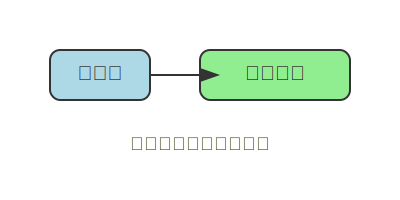

# C# 变量

## 什么是变量



变量是用来存储数据的容器。

在 `C#` 中，每个变量都有一个特定的类型，用来确定变量可以存储什么样的数据。

## 变量声明

在C#中，声明变量的基本语法是：

```csharp
数据类型 变量名;
```

例如：
```csharp
int age;        // 声明一个整数变量
string name;    // 声明一个字符串变量
double price;   // 声明一个双精度浮点数变量
```

## 变量初始化

可以在声明变量的同时给它赋值：

```csharp
int age = 25;
string name = "张三";
double price = 99.99;
bool isStudent = true;
```

## 常用数据类型

### 数值类型

| 类型      | 描述          |                          范围                           | 示例                         |
| --------- | ------------- | :-----------------------------------------------------: | ---------------------------- |
| `int`     | 32位整数      |             -2,147,483,648 到 2,147,483,647             | `int count = 10;`            |
| `long`    | 64位整数      | -9,223,372,036,854,775,808 到 9,223,372,036,854,775,807 | `long bigNumber = 1000000L;` |
| `float`   | 32位浮点数    |              ±1.5 x 10^-45 到 ±3.4 x 10^38              | `float temperature = 36.5f;` |
| `double`  | 64位浮点数    |             ±5.0 × 10^-324 到 ±1.7 × 10^308             | `double pi = 3.14159;`       |
| `decimal` | 128位十进制数 |            ±1.0 x 10^-28 到 ±7.9228 x 10^28             | `decimal money = 1000.50m;`  |

### 字符和字符串类型

```csharp
char letter = 'A';           // 单个字符
string message = "Hello";    // 字符串
```

### 布尔类型

```csharp
bool isTrue = true;
bool isFalse = false;
```

## 变量命名规则

1. **必须以字母或下划线开头**
   ```csharp
   int age;        // ✓ 正确
   int _count;     // ✓ 正确
   int 2name;      // ✗ 错误
   ```

2. **可以包含字母、数字和下划线**
   ```csharp
   int user_age;   // ✓ 正确
   int user2;      // ✓ 正确
   int user-name;  // ✗ 错误（不能包含连字符）
   ```

3. **区分大小写**
   ```csharp
   int age;
   int Age;        // 这是两个不同的变量
   ```

4. **不能使用C#关键字**
   ```csharp
   int class;      // ✗ 错误（class是关键字）
   int @class;     // ✓ 正确（使用@前缀）
   ```

## 命名约定

### ==camelCase（驼峰命名法）==
<u>用于局部变量和字段：</u> 

```csharp
int studentAge;
string firstName;
double totalPrice;
```

### ==PascalCase（帕斯卡命名法）==
<u>用于类名、方法名、属性名：</u>

```csharp
public class StudentInfo
{
    public string FirstName { get; set; }
    public void CalculateAge() { }
}
```

## var 关键字

使用 `var` 关键字可以让编译器自动推断变量类型：

```csharp
var age = 25;           // 编译器推断为 int
var name = "张三";       // 编译器推断为 string
var price = 99.99;      // 编译器推断为 double
var isStudent = true;   // 编译器推断为 bool
```

**注意：** 使用 `var` 时必须在声明时初始化变量。

## 实例代码

```csharp
using System;

class Program
{
    static void Main()
    {
        // 声明和初始化变量
        int age = 20;
        string name = "李明";
        double height = 175.5;
        bool isStudent = true;
        
        // 输出变量值
        Console.WriteLine($"姓名：{name}");
        Console.WriteLine($"年龄：{age}");
        Console.WriteLine($"身高：{height}cm");
        Console.WriteLine($"是否为学生：{isStudent}");
        
        // 修改变量值
        age = 21;
        height = 176.0;
        
        Console.WriteLine($"\n更新后的信息：");
        Console.WriteLine($"年龄：{age}");
        Console.WriteLine($"身高：{height}cm");
    }
}
```

## 小结

- 变量是存储数据的容器
- 每个变量都有特定的数据类型
- 变量名必须遵循命名规则和约定
- 良好的命名习惯有助于代码的可读性和维护性