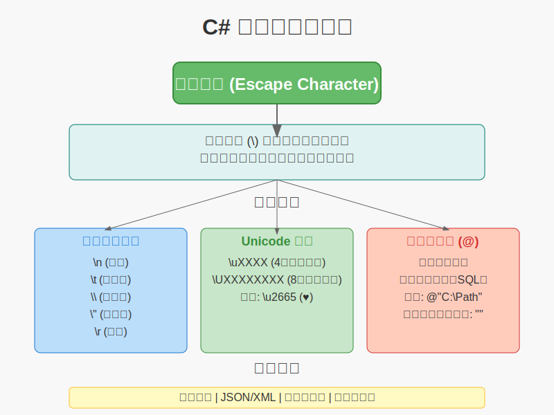

# C# 转义字符



## 什么是转义字符

转义字符是以反斜杠（`\`）开头的特殊字符序列，用于表示那些无法直接在字符串中输入或显示的字符。

在 `C#` 中，转义字符让我们能够在字符串中包含特殊字符，如换行符、制表符、引号等。

## 常用转义字符

### 基本转义字符表

| 转义字符 | 描述 | ASCII码 | 示例 |
|----------|------|---------|------|
| `\n` | 换行符（Line Feed） | 10 | `"第一行\n第二行"` |
| `\r` | 回车符（Carriage Return） | 13 | `"Hello\rWorld"` |
| `\t` | 制表符（Tab） | 9 | `"姓名\t年龄"` |
| `\b` | 退格符（Backspace） | 8 | `"Hello\bWorld"` |
| `\f` | 换页符（Form Feed） | 12 | `"Page1\fPage2"` |
| `\v` | 垂直制表符（Vertical Tab） | 11 | `"Line1\vLine2"` |
| `\0` | 空字符（Null） | 0 | `"Hello\0World"` |
| `\\` | 反斜杠 | 92 | `"C:\\Users\\Name"` |
| `\'` | 单引号 | 39 | `'It\'s a test'` |
| `\"` | 双引号 | 34 | `"He said \"Hello\""` |

### 详细说明和示例

#### 1. 换行符 (`\n`)

```csharp
string message = "第一行\n第二行\n第三行";
Console.WriteLine(message);
// 输出：
// 第一行
// 第二行
// 第三行
```

#### 2. 回车符 (`\r`)

```csharp
// 在Windows系统中，通常使用 \r\n 作为换行
string windowsNewline = "第一行\r\n第二行";
Console.WriteLine(windowsNewline);
```

#### 3. 制表符 (`\t`)

```csharp
string table = "姓名\t年龄\t城市\n张三\t25\t北京\n李四\t30\t上海";
Console.WriteLine(table);
// 输出：
// 姓名    年龄    城市
// 张三    25      北京
// 李四    30      上海
```

#### 4. 反斜杠 (`\\`)

```csharp
string filePath = "C:\\Users\\Administrator\\Documents\\file.txt";
Console.WriteLine(filePath);
// 输出：C:\Users\Administrator\Documents\file.txt
```

#### 5. 引号转义

```csharp
// 双引号转义
string quote = "他说：\"今天天气真好！\"";
Console.WriteLine(quote);
// 输出：他说："今天天气真好！"

// 单引号转义（在字符中）
char apostrophe = '\'';
Console.WriteLine($"撇号字符：{apostrophe}");
// 输出：撇号字符：'
```

## Unicode 转义字符

### Unicode 转义序列

C# 支持使用 Unicode 转义序列来表示任何 Unicode 字符：

- `\uXXXX`：4位十六进制数表示的Unicode字符
- `\UXXXXXXXX`：8位十六进制数表示的Unicode字符

```csharp
// 使用Unicode转义序列
string heart = "\u2665";        // ♥ 心形符号
string smiley = "\u263A";       // ☺ 笑脸符号
string chinese = "\u4E2D\u6587"; // 中文

Console.WriteLine($"心形：{heart}");
Console.WriteLine($"笑脸：{smiley}");
Console.WriteLine($"中文：{chinese}");
```

### 十六进制转义序列

使用 `\xXX` 表示十六进制ASCII字符：

```csharp
string hex1 = "\x41";    // A (ASCII 65)
string hex2 = "\x42";    // B (ASCII 66)
string hex3 = "\x43";    // C (ASCII 67)

Console.WriteLine($"{hex1}{hex2}{hex3}"); // 输出：ABC
```

## 逐字字符串（Verbatim Strings）

### 使用 @ 符号

在字符串前加上 `@` 符号可以创建逐字字符串，其中的转义字符不会被处理：

```csharp
// 普通字符串（需要转义）
string normalPath = "C:\\Users\\Name\\Documents\\file.txt";

// 逐字字符串（不需要转义）
string verbatimPath = @"C:\Users\Name\Documents\file.txt";

Console.WriteLine(normalPath);
Console.WriteLine(verbatimPath);
// 两者输出相同：C:\Users\Name\Documents\file.txt
```

### 逐字字符串中的引号

在逐字字符串中，双引号需要用两个双引号表示：

```csharp
string verbatimQuote = @"他说：""今天天气真好！""";
Console.WriteLine(verbatimQuote);
// 输出：他说："今天天气真好！"
```

### 多行逐字字符串

```csharp
string multiLine = @"第一行
第二行
第三行";
Console.WriteLine(multiLine);
// 输出：
// 第一行
// 第二行
// 第三行

// SQL查询示例
string sql = @"SELECT 
    Name, 
    Age, 
    City 
FROM 
    Users 
WHERE 
    Age > 18";
Console.WriteLine(sql);
```

## 字符串插值中的转义

在字符串插值（`$"..."`）中也可以使用转义字符：

```csharp
string name = "张三";
int age = 25;

string info = $"姓名：{name}\n年龄：{age}\n状态：\"活跃\"";
Console.WriteLine(info);
// 输出：
// 姓名：张三
// 年龄：25
// 状态："活跃"
```

### 逐字字符串插值

结合 `@` 和 `$` 符号：

```csharp
string fileName = "data.txt";
string path = $@"C:\Users\{Environment.UserName}\Documents\{fileName}";
Console.WriteLine(path);
// 输出类似：C:\Users\CurrentUser\Documents\data.txt
```

## 实际应用示例

### 1. 文件路径处理

```csharp
using System;
using System.IO;

class PathExample
{
    static void Main()
    {
        // 方法1：使用转义字符
        string path1 = "C:\\Program Files\\MyApp\\config.txt";
        
        // 方法2：使用逐字字符串
        string path2 = @"C:\Program Files\MyApp\config.txt";
        
        // 方法3：使用Path.Combine（推荐）
        string path3 = Path.Combine("C:", "Program Files", "MyApp", "config.txt");
        
        Console.WriteLine($"方法1：{path1}");
        Console.WriteLine($"方法2：{path2}");
        Console.WriteLine($"方法3：{path3}");
    }
}
```

### 2. JSON字符串处理

```csharp
class JsonExample
{
    static void Main()
    {
        string name = "张三";
        int age = 25;
        
        // 使用转义字符构建JSON
        string json1 = "{\"name\":\"" + name + "\",\"age\":" + age + "}";
        
        // 使用字符串插值和转义字符
        string json2 = $"{{\"name\":\"{name}\",\"age\":{age}}}";
        
        // 使用逐字字符串（多行）
        string json3 = $@"{{
    ""name"": ""{name}"",
    ""age"": {age}
}}";
        
        Console.WriteLine("JSON方法1：" + json1);
        Console.WriteLine("JSON方法2：" + json2);
        Console.WriteLine("JSON方法3：\n" + json3);
    }
}
```

### 3. 格式化输出

```csharp
class FormattingExample
{
    static void Main()
    {
        string[] students = { "张三", "李四", "王五" };
        int[] scores = { 85, 92, 78 };
        
        Console.WriteLine("学生成绩表");
        Console.WriteLine("====================");
        Console.WriteLine("姓名\t\t成绩");
        Console.WriteLine("----\t\t----");
        
        for (int i = 0; i < students.Length; i++)
        {
            Console.WriteLine($"{students[i]}\t\t{scores[i]}");
        }
        
        Console.WriteLine("====================");
        Console.WriteLine($"平均分：{(scores[0] + scores[1] + scores[2]) / 3.0:F2}");
    }
}
```

### 4. 正则表达式模式

```csharp
using System;
using System.Text.RegularExpressions;

class RegexExample
{
    static void Main()
    {
        // 使用逐字字符串定义正则表达式模式
        string emailPattern = @"^[a-zA-Z0-9._%+-]+@[a-zA-Z0-9.-]+\.[a-zA-Z]{2,}$";
        string phonePattern = @"^\d{3}-\d{4}-\d{4}$";
        
        string email = "user@example.com";
        string phone = "138-1234-5678";
        
        bool isValidEmail = Regex.IsMatch(email, emailPattern);
        bool isValidPhone = Regex.IsMatch(phone, phonePattern);
        
        Console.WriteLine($"邮箱 {email} 验证结果：{isValidEmail}");
        Console.WriteLine($"电话 {phone} 验证结果：{isValidPhone}");
    }
}
```

## 转义字符的性能考虑

### StringBuilder 与转义字符

```csharp
using System;
using System.Text;

class PerformanceExample
{
    static void Main()
    {
        // 大量字符串拼接时使用StringBuilder
        StringBuilder sb = new StringBuilder();
        
        for (int i = 0; i < 1000; i++)
        {
            sb.AppendLine($"第{i + 1}行\t数据{i}");
        }
        
        string result = sb.ToString();
        Console.WriteLine($"生成了 {result.Split('\n').Length} 行数据");
    }
}
```

## 常见错误和解决方案

### 1. 路径分隔符错误

```csharp
// ❌ 错误：忘记转义反斜杠
// string path = "C:\Users\Name"; // 编译错误

// ✅ 正确方法1：转义反斜杠
string path1 = "C:\\Users\\Name";

// ✅ 正确方法2：使用逐字字符串
string path2 = @"C:\Users\Name";

// ✅ 正确方法3：使用正斜杠（在.NET中也有效）
string path3 = "C:/Users/Name";
```

### 2. 引号嵌套错误

```csharp
// ❌ 错误：引号没有正确转义
// string message = "He said "Hello"!"; // 编译错误

// ✅ 正确方法1：转义双引号
string message1 = "He said \"Hello\"!";

// ✅ 正确方法2：使用逐字字符串
string message2 = @"He said ""Hello""!";

// ✅ 正确方法3：混合使用单引号和双引号
string message3 = "He said 'Hello'!";
```

### 3. 换行符平台差异

```csharp
// 不同平台的换行符
string windowsNewline = "\r\n";  // Windows
string unixNewline = "\n";      // Unix/Linux/macOS

// 使用Environment.NewLine获取当前平台的换行符
string platformNewline = Environment.NewLine;

string message = $"第一行{Environment.NewLine}第二行{Environment.NewLine}第三行";
Console.WriteLine(message);
```

## 最佳实践

### 1. 选择合适的字符串类型

```csharp
// 文件路径：推荐使用逐字字符串
string configPath = @"C:\Program Files\MyApp\config.xml";

// 正则表达式：推荐使用逐字字符串
string pattern = @"\d{4}-\d{2}-\d{2}";

// 简单文本：可以使用普通字符串
string greeting = "Hello\nWorld";

// JSON或XML：考虑使用专门的库而不是手动拼接
```

### 2. 代码可读性

```csharp
// ✅ 好的做法：使用有意义的变量名
string sqlQuery = @"SELECT 
    CustomerName, 
    OrderDate, 
    TotalAmount 
FROM 
    Orders 
WHERE 
    OrderDate >= @StartDate";

// ❌ 不好的做法：复杂的转义字符串
string complexString = "Line1\n\tIndented\n\t\tDouble Indented\n\"Quoted\"";
```

### 3. 安全性考虑

```csharp
// 避免在字符串中硬编码敏感信息
// ❌ 不安全
string connectionString = @"Server=localhost;Database=MyDB;User=admin;Password=123456;";

// ✅ 更安全：从配置文件或环境变量读取
string server = Environment.GetEnvironmentVariable("DB_SERVER") ?? "localhost";
string database = Environment.GetEnvironmentVariable("DB_NAME") ?? "MyDB";
```

## 小结

- **转义字符**：使用反斜杠（`\`）开头的特殊字符序列
- **常用转义字符**：`\n`（换行）、`\t`（制表符）、`\\`（反斜杠）、`\"`（双引号）
- **逐字字符串**：使用 `@` 前缀，避免转义字符处理
- **Unicode转义**：`\uXXXX` 和 `\UXXXXXXXX` 表示Unicode字符
- **字符串插值**：在 `$"..."` 中也可以使用转义字符
- **最佳实践**：根据使用场景选择合适的字符串类型，注意平台差异和安全性
- **性能考虑**：大量字符串操作时使用 `StringBuilder`

掌握转义字符的使用对于处理文件路径、格式化输出、正则表达式等场景非常重要。