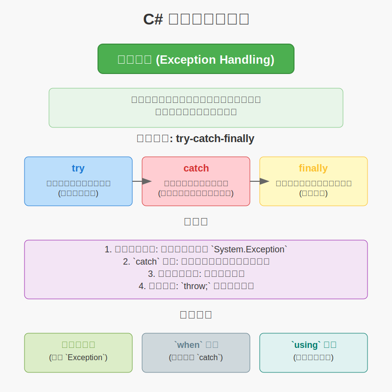

# 6. C# 异常捕获

在程序执行过程中，可能会发生各种预料之外的错误或异常情况，例如尝试除以零、访问不存在的文件、网络连接中断等。如果不对这些异常进行处理，程序通常会崩溃并终止执行。

C# 提供了一套强大的异常处理机制，允许开发者优雅地捕获和响应这些运行时错误，从而提高程序的健壮性和用户体验。

异常捕获主要通过 `try-catch-finally` 语句块来实现。

## ==基本语法==

```csharp
try
{
    // 可能会抛出异常的代码块
    // 例如：文件操作、网络请求、数学运算等
}
catch (ExceptionType1 ex1) // 可选，特定类型的异常
{
    // 处理 ExceptionType1 类型的异常
    // ex1 是一个异常对象，包含了异常的详细信息
}
catch (ExceptionType2 ex2) // 可选，特定类型的异常
{
    // 处理 ExceptionType2 类型的异常
}
catch (Exception ex) // 可选，捕获所有其他类型的异常 (通常放在最后)
{
    // 处理所有未被前面 catch 块捕获的异常
    // Exception 是所有异常类型的基类
}
finally // 可选
{
    // 无论是否发生异常，也无论异常是否被捕获，
    // finally 块中的代码总是会被执行。
    // 通常用于释放资源，如关闭文件、数据库连接等。
}
```

## 关键点

1.  **异常的层次结构**：C# 中的异常都是派生自 `System.Exception` 类的对象。常见的内置异常类型包括 `NullReferenceException`、`IndexOutOfRangeException`、`DivideByZeroException`、`FileNotFoundException`、`FormatException` 等。你可以捕获特定的异常类型，也可以捕获通用的 `Exception` 类型。

2.  **`catch` 块的顺序**：当有多个 `catch` 块时，它们的顺序很重要。应该将更具体的异常类型（派生类）的 `catch` 块放在更通用的异常类型（基类）的 `catch` 块之前。否则，如果基类 `catch` 块在前，它会捕获所有派生类的异常，导致后面的特定 `catch` 块永远不会被执行，编译器通常会对此发出警告或错误。

3.  **不捕获不处理的异常**：通常不建议捕获一个异常然后什么都不做（空的 `catch` 块），或者仅仅是记录日志而不采取任何纠正措施或向上重新抛出。这可能会隐藏问题，使调试更加困难。如果不知道如何处理某个特定异常，最好不要捕获它，让它传播到更高层级的代码去处理，或者让程序按预期失败。

4.  **重新抛出异常**：
    *   在 `catch` 块中，可以使用 `throw;` 语句重新抛出当前捕获到的异常。这会保留原始异常的堆栈跟踪信息，有助于调试。
    *   使用 `throw ex;` (其中 `ex` 是捕获到的异常对象) 也会重新抛出异常，但它会重置堆栈跟踪信息，使得异常看起来像是从当前 `catch` 块的位置开始的，这通常是不推荐的，因为它会丢失原始的错误发生点信息。

5.  **自定义异常**：可以创建自己的异常类，通过继承 `System.Exception` 或其派生类来实现。这有助于定义应用程序特有的错误条件。

6.  **`when` 子句 (C# 6.0及更高版本)**：`catch` 块可以带有一个 `when` 子句，它允许你根据异常对象的属性或其他条件来决定是否执行该 `catch` 块。
    ```csharp
    try
    {
        // ...
    }
    catch (HttpRequestException ex) when (ex.StatusCode == System.Net.HttpStatusCode.NotFound)
    {
        // 只处理 HTTP 404 Not Found 错误
        Console.WriteLine("资源未找到。");
    }
    catch (HttpRequestException ex)
    {
        // 处理其他 HttpRequestException 错误
        Console.WriteLine($"HTTP 请求错误: {ex.Message}");
    }
    ```

## 示例代码

### 示例 1：基本异常捕获 (除以零)

```csharp
using System;

public class ExceptionHandlingDemo
{
    public static void Main(string[] args)
    {
        Console.WriteLine("请输入一个数字作为被除数:");
        string input1 = Console.ReadLine();
        Console.WriteLine("请输入一个数字作为除数:");
        string input2 = Console.ReadLine();

        try
        {
            int numerator = int.Parse(input1);
            int denominator = int.Parse(input2);

            if (denominator == 0)
            {
                // 主动抛出异常，虽然除法运算自己也会抛 DivideByZeroException
                throw new DivideByZeroException("除数不能为零 (自定义消息)。");
            }

            int result = numerator / denominator;
            Console.WriteLine($"结果: {numerator} / {denominator} = {result}");
        }
        catch (FormatException ex)
        {
            Console.WriteLine($"输入格式错误: {ex.Message}");
            Console.WriteLine("请输入有效的整数。");
        }
        catch (DivideByZeroException ex)
        {
            Console.WriteLine($"算术错误: {ex.Message}");
        }
        catch (Exception ex) // 通用异常捕获
        {
            Console.WriteLine($"发生了一个未知错误: {ex.Message}");
            Console.WriteLine($"堆栈跟踪: \n{ex.StackTrace}");
        }
        finally
        {
            Console.WriteLine("--- 计算结束 --- (finally 块执行)");
        }

        Console.WriteLine("程序继续执行...");
    }
}
```

**可能的输出：**

*   **输入有效整数 (例如 10 和 2):**
    ```
    请输入一个数字作为被除数:
    10
    请输入一个数字作为除数:
    2
    结果: 10 / 2 = 5
    --- 计算结束 --- (finally 块执行)
    程序继续执行...
    ```
*   **输入非数字 (例如 "abc" 作为被除数):**
    ```
    请输入一个数字作为被除数:
    abc
    请输入一个数字作为除数:
    5
    输入格式错误: Input string was not in a correct format.
    请输入有效的整数。
    --- 计算结束 --- (finally 块执行)
    程序继续执行...
    ```
*   **输入除数为 0:**
    ```
    请输入一个数字作为被除数:
    10
    请输入一个数字作为除数:
    0
    算术错误: 除数不能为零 (自定义消息)。
    --- 计算结束 --- (finally 块执行)
    程序继续执行...
    ```

### 示例 2：使用 `finally` 确保资源释放

```csharp
using System;
using System.IO;

public class FinallyDemo
{
    public static void Main(string[] args)
    {
        StreamReader reader = null;
        try
        {
            string filePath = "non_existent_file.txt";
            reader = new StreamReader(filePath);
            string content = reader.ReadToEnd();
            Console.WriteLine("文件内容:");
            Console.WriteLine(content);
        }
        catch (FileNotFoundException ex)
        {
            Console.WriteLine($"文件未找到错误: {ex.Message}");
        }
        catch (IOException ex)
        {
            Console.WriteLine($"IO 错误: {ex.Message}");
        }
        finally
        {
            if (reader != null)
            {
                Console.WriteLine("在 finally 块中关闭 StreamReader。");
                reader.Close(); // 确保 StreamReader 被关闭
                reader.Dispose(); // 释放资源
            }
            else
            {
                Console.WriteLine("StreamReader 未被初始化，无需关闭。");
            }
        }
    }
}
```
在这个例子中，即使 `non_existent_file.txt` 不存在导致 `FileNotFoundException`，`finally` 块也会执行，尝试关闭 `reader`（如果它被成功初始化的话）。

**注意：** 对于实现了 `IDisposable` 接口的类型（如 `StreamReader`），更现代和推荐的做法是使用 `using` 语句，它能自动确保对象的 `Dispose` 方法被调用，从而简化资源管理并减少 `finally` 块的显式使用。

```csharp
// 使用 using 语句简化资源管理
using System;
using System.IO;

public class UsingDemo
{
    public static void Main(string[] args)
    {
        try
        {
            string filePath = "non_existent_file.txt";
            // using 语句会自动处理 reader.Dispose()
            using (StreamReader reader = new StreamReader(filePath))
            {
                string content = reader.ReadToEnd();
                Console.WriteLine("文件内容:");
                Console.WriteLine(content);
            } // reader.Dispose() 会在这里被自动调用，即使发生异常
        }
        catch (FileNotFoundException ex)
        {
            Console.WriteLine($"文件未找到错误: {ex.Message}");
        }
        catch (IOException ex)
        {
            Console.WriteLine($"IO 错误: {ex.Message}");
        }
        Console.WriteLine("程序结束。");
    }
}
```

## 总结

异常处理是编写可靠 C# 应用程序的关键部分。通过合理使用 `try-catch-finally` 块，你可以：

*   **捕获并处理运行时错误**，防止程序意外终止。
*   **提供更友好的用户反馈**，而不是显示原始的、可能令人困惑的错误信息。
*   **确保关键资源得到释放**，避免资源泄漏。
*   **将错误处理逻辑与正常业务逻辑分离**，使代码更清晰、更易于维护。

理解何时捕获特定异常、何时使用通用异常处理、何时重新抛出异常以及如何利用 `finally` 或 `using` 语句进行资源管理，对于编写高质量的 C# 代码至关重要。