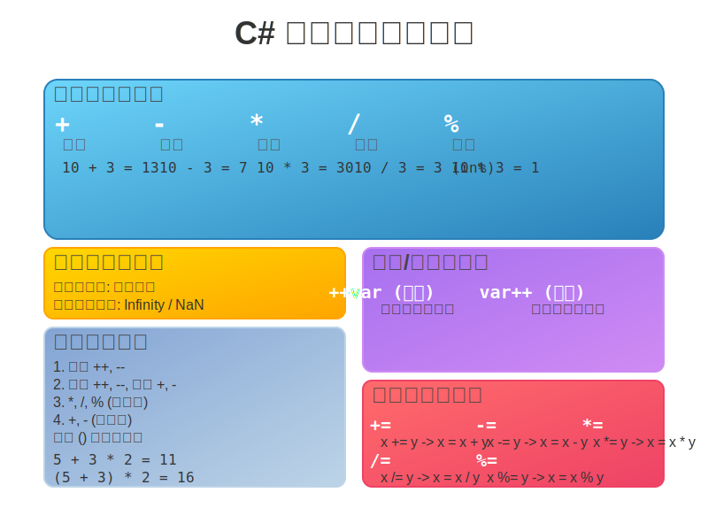

# 7. C# 算术运算符



算术运算符是编程中最基本和常用的运算符之一，用于执行数学计算，如加法、减法、乘法、除法和取余（模运算）。

C# 支持所有标准的算术运算符，并且它们可以应用于各种数值类型（如 `int`, `float`, `double`, `decimal` 等）。

## 基本算术运算符

C# 中主要的算术运算符包括：

| 运算符 | 名称     | 描述                                     | 示例 (`int a = 10, b = 3;`) | 结果    |
| :----- | :------- | :--------------------------------------- | :-------------------------- | :------ |
| `+`    | 加法     | 将两个操作数相加                           | `a + b`                     | `13`    |
| `-`    | 减法     | 从第一个操作数中减去第二个操作数             | `a - b`                     | `7`     |
| `*`    | 乘法     | 将两个操作数相乘                           | `a * b`                     | `30`    |
| `/`    | 除法     | 第一个操作数除以第二个操作数                 | `a / b`                     | `3` (整数除法) |
| `%`    | 取余 (模) | 返回第一个操作数除以第二个操作数后的余数     | `a % b`                     | `1`     |

## 运算符详解与注意事项

### 1. 加法 (`+`)

*   用于数字相加。
*   也用于字符串连接（详见字符串拼接章节）。

```csharp
int x = 5;
int y = 10;
int sum = x + y; // sum = 15

double d1 = 3.14;
double d2 = 2.71;
double doubleSum = d1 + d2; // doubleSum = 5.85

string s1 = "Hello, ";
string s2 = "World!";
string message = s1 + s2; // message = "Hello, World!"
```

### 2. 减法 (`-`)

*   用于数字相减。
*   也可以用作一元运算符，表示负值。

```csharp
int a = 10;
int b = 4;
int difference = a - b; // difference = 6

int negativeValue = -a; // negativeValue = -10 (一元减法)
```

### 3. 乘法 (`*`)

*   用于数字相乘。

```csharp
int p = 7;
int q = 6;
int product = p * q; // product = 42

double val1 = 2.5;
double val2 = 4.0;
double doubleProduct = val1 * val2; // doubleProduct = 10.0
```

### 4. 除法 (`/`)

*   **整数除法**：如果两个操作数都是整数类型（如 `int`, `long`），则执行整数除法。结果会截断小数部分，只保留整数部分。
    ```csharp
    int num1 = 10;
    int num2 = 3;
    int intResult = num1 / num2; // intResult = 3 (10 / 3 = 3.333...，小数部分被截断)
    
    int num3 = 7;
    int num4 = 2;
    int intResult2 = num3 / num4; // intResult2 = 3 (7 / 2 = 3.5，小数部分被截断)
    ```
*   **浮点数除法**：如果至少有一个操作数是浮点类型（如 `float`, `double`, `decimal`），则执行浮点数除法，结果会保留小数部分。
    ```csharp
    double dbl1 = 10.0;
    double dbl2 = 3.0;
    double doubleResult = dbl1 / dbl2; // doubleResult = 3.3333333333333335
    
    int intVal = 7;
    double dblVal = 2.0;
    double mixedResult = intVal / dblVal; // mixedResult = 3.5 (intVal 会被隐式转换为 double)
    ```
*   **除以零**：
    *   对于整数类型，除以零 (`0`) 会在运行时抛出 `System.DivideByZeroException` 异常。
    *   对于浮点类型 (`float`, `double`)，除以零 (`0.0`) 不会抛出异常，而是会得到特殊的值：
        *   正数 / 0.0  ->  `Infinity` (正无穷大)
        *   负数 / 0.0  ->  `-Infinity` (负无穷大)
        *   0.0 / 0.0   ->  `NaN` (Not a Number，非数字)
    ```csharp
    // int zeroInt = 0;
    // int error = 10 / zeroInt; // 抛出 DivideByZeroException
    
    double zeroDouble = 0.0;
    double positiveInfinity = 10.0 / zeroDouble; // positiveInfinity = Infinity
    double negativeInfinity = -10.0 / zeroDouble; // negativeInfinity = -Infinity
    double notANumber = 0.0 / zeroDouble;      // notANumber = NaN
    
    Console.WriteLine($"10.0 / 0.0 = {positiveInfinity}");
    Console.WriteLine($"-10.0 / 0.0 = {negativeInfinity}");
    Console.WriteLine($"0.0 / 0.0 = {notANumber}");
    ```

### 5. 取余 (模) (`%`)

*   返回第一个操作数除以第二个操作数后的整数余数。
*   结果的符号与第一个操作数（被除数）的符号相同。
*   通常用于判断一个数是否能被另一个数整除（余数为0），或者在特定范围内循环取值。

```csharp
int r1 = 10 % 3;  // r1 = 1  (10 = 3*3 + 1)
int r2 = 11 % 3;  // r2 = 2  (11 = 3*3 + 2)
int r3 = 12 % 3;  // r3 = 0  (12 = 3*4 + 0)

int r4 = -10 % 3; // r4 = -1 (-10 = 3*(-3) - 1)
int r5 = 10 % -3; // r5 = 1  (10 = (-3)*(-3) + 1)
int r6 = -10 % -3;// r6 = -1 (-10 = (-3)*3 - 1)

// 判断奇偶数
int number = 7;
if (number % 2 == 0)
{
    Console.WriteLine($"{number} 是偶数");
}
else
{
    Console.WriteLine($"{number} 是奇数"); // 输出: 7 是奇数
}
```
*   **对浮点数取余**：`%` 运算符也可以用于浮点数，其行为遵循 IEEE 754 标准。结果是 `x - n * y`，其中 `n` 是使得 `x - n * y` 的绝对值尽可能小的整数，如果存在两个这样的 `n`，则选择偶数的那个 `n`。如果 `y` 是零，结果是 `NaN`。
    ```csharp
    double dRem1 = 5.0 % 2.0;   // dRem1 = 1.0
    double dRem2 = 5.5 % 2.0;   // dRem2 = 1.5
    double dRem3 = -5.5 % 2.0;  // dRem3 = -1.5 (符号与被除数相同)
    double dRem4 = 5.0 % 0.0;   // dRem4 = NaN
    ```

## 递增 (`++`) 和递减 (`--`) 运算符

C# 还提供了用于将变量的值增加1或减少1的快捷运算符。

*   **`++` (递增)**：将操作数的值增加1。
*   **`--` (递减)**：将操作数的值减少1。

它们都有两种形式：前缀形式和后缀形式。

### 前缀形式 (`++variable` 或 `--variable`)

1.  变量的值先增加或减少1。
2.  然后，表达式的结果是变量 **新** 的值。

```csharp
int count = 5;
int prefixIncrementResult = ++count; // count 先变成 6，然后 prefixIncrementResult 被赋值为 6
// 此时 count = 6, prefixIncrementResult = 6
Console.WriteLine($"Prefix Increment: count = {count}, result = {prefixIncrementResult}");

int value = 10;
int prefixDecrementResult = --value; // value 先变成 9，然后 prefixDecrementResult 被赋值为 9
// 此时 value = 9, prefixDecrementResult = 9
Console.WriteLine($"Prefix Decrement: value = {value}, result = {prefixDecrementResult}");
```

### 后缀形式 (`variable++` 或 `variable--`)

1.  变量 **原始** 的值被用作表达式的结果。
2.  然后，变量的值增加或减少1。

```csharp
int num = 5;
int postfixIncrementResult = num++; // postfixIncrementResult 先被赋值为 num 的原始值 5，然后 num 变成 6
// 此时 num = 6, postfixIncrementResult = 5
Console.WriteLine($"Postfix Increment: num = {num}, result = {postfixIncrementResult}");

int val = 10;
int postfixDecrementResult = val--; // postfixDecrementResult 先被赋值为 val 的原始值 10，然后 val 变成 9
// 此时 val = 9, postfixDecrementResult = 10
Console.WriteLine($"Postfix Decrement: val = {val}, result = {postfixDecrementResult}");
```

**使用建议**：

*   如果递增/递减操作本身就是一条独立的语句，前缀和后缀形式没有实际区别。
    ```csharp
    int i = 0;
    i++; // 等效于 ++i; (如果只是为了增加 i 的值)
    ```
*   当递增/递减操作作为更复杂表达式的一部分时，前缀和后缀的区别就很重要了。为了代码清晰，有时最好将递增/递减操作分离成独立的语句。

## 运算符优先级和结合性

算术运算符有其固有的优先级和结合性，这决定了复杂表达式的求值顺序。

*   **优先级** (从高到低大致顺序):
    1.  `++` (后缀), `--` (后缀)
    2.  `+` (一元正), `-` (一元负), `++` (前缀), `--` (前缀)
    3.  `*`, `/`, `%` (乘法、除法、取余，从左到右结合)
    4.  `+`, `-` (加法、减法，从左到右结合)
*   可以使用圆括号 `()` 来显式控制运算顺序，提高代码的可读性并避免混淆。

```csharp
int a = 5, b = 3, c = 2;
int result1 = a + b * c;   // 乘法优先: 5 + (3 * 2) = 5 + 6 = 11
int result2 = (a + b) * c; // 括号优先: (5 + 3) * 2 = 8 * 2 = 16

int x = 10;
int y = x++ * 2; // 后缀++优先级高，但值是原始值: y = 10 * 2 = 20; 之后 x 变为 11
Console.WriteLine($"x = {x}, y = {y}"); // 输出: x = 11, y = 20

x = 10;
int z = ++x * 2; // 前缀++优先级高，值是新值: x 变为 11; z = 11 * 2 = 22
Console.WriteLine($"x = {x}, z = {z}"); // 输出: x = 11, z = 22
```

## 复合赋值运算符

C# 还提供了一组复合赋值运算符，它们将算术运算与赋值操作结合起来，使代码更简洁。

| 运算符 | 示例    | 等效于     |
| :----- | :------ | :--------- |
| `+=`   | `x += y`| `x = x + y`|
| `-=`   | `x -= y`| `x = x - y`|
| `*=`   | `x *= y`| `x = x * y`|
| `/=`   | `x /= y`| `x = x / y`|
| `%=`   | `x %= y`| `x = x % y`|

```csharp
int score = 100;
score += 10; // score = score + 10;  score 现在是 110

int items = 25;
items -= 5;  // items = items - 5;   items 现在是 20

int factor = 2;
factor *= 3; // factor = factor * 3; factor 现在是 6

int total = 50;
total /= 2;  // total = total / 2;   total 现在是 25

int remainder = 17;
remainder %= 5; // remainder = remainder % 5; remainder 现在是 2
```

## 总结

算术运算符是 C# 编程的基础。理解它们的行为，特别是整数除法、除以零的情况、递增/递减运算符的前后缀区别以及运算符的优先级，对于编写正确和高效的代码至关重要。复合赋值运算符则提供了一种更简洁的方式来更新变量的值。