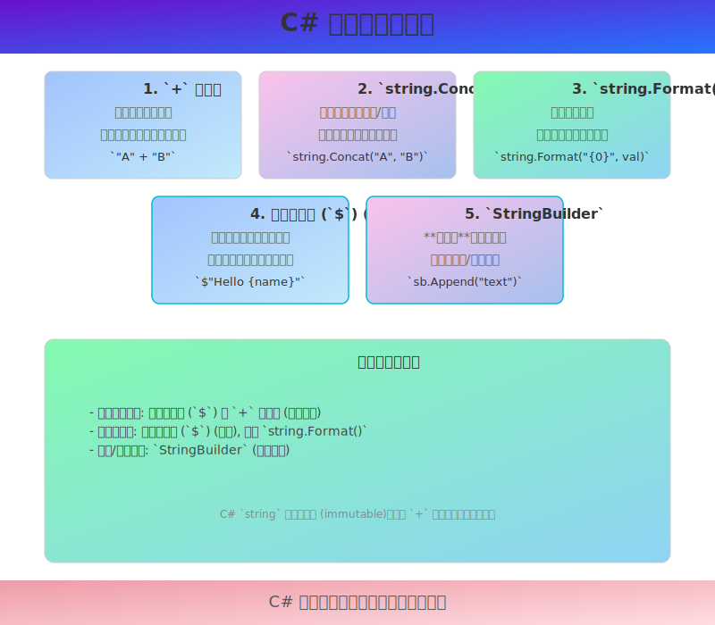

# 8. C# 字符串拼接



字符串拼接（String Concatenation）是将多个字符串或字符串与其他数据类型的值组合成一个新字符串的过程。

在 C# 中，有多种方法可以实现字符串拼接，每种方法在不同场景下有其优缺点，尤其是在性能方面。

## 1. 使用加号 (`+`) 运算符

这是最直观和最常用的字符串拼接方式。`+` 运算符被重载以支持字符串连接。

```csharp
string firstName = "John";
string lastName = "Doe";
int age = 30;

// 拼接两个字符串
string fullName = firstName + " " + lastName;
Console.WriteLine(fullName); // 输出: John Doe

// 拼接字符串和数字 (数字会自动转换为字符串)
string userInfo = "Name: " + fullName + ", Age: " + age;
Console.WriteLine(userInfo); // 输出: Name: John Doe, Age: 30
```

**工作原理与性能考虑：**

*   C# 中的 `string` 类型是 **不可变的 (immutable)**。这意味着一旦一个字符串对象被创建，它的内容就不能被修改。
*   当你使用 `+` 运算符拼接字符串时，实际上是创建了一个 **新的字符串对象** 来存储结果。例如，`s1 + s2` 会创建一个新的字符串，包含 `s1` 和 `s2` 的内容。
*   <u>如果在一个循环中或者需要拼接大量字符串片段时，频繁使用 `+` 运算符会导致创建大量临时的字符串对象，这会给垃圾回收器 (GC) 带来压力，并可能导致性能下降。</u>

```csharp
// 低效的循环拼接示例
string numbers = "";
for (int i = 1; i <= 5; i++)
{
    numbers = numbers + i.ToString() + " "; // 每次循环都会创建新的字符串对象
}
Console.WriteLine(numbers); // 输出: 1 2 3 4 5
```
对于少量、简单的拼接，`+` 运算符是可接受的。但对于大量或复杂的拼接，应考虑其他更高效的方法。

## 2. 使用 `string.Concat()` 方法

`string.Concat()` 方法提供了一种显式拼接字符串的方式。它有多个重载版本，可以接受不同数量的字符串参数或一个字符串数组。

```csharp
string str1 = "Hello";
string str2 = " ";
string str3 = "World";
int year = 2023;

// 拼接多个字符串
string greeting = string.Concat(str1, str2, str3, "!");
Console.WriteLine(greeting); // 输出: Hello World!

// 拼接字符串和非字符串 (非字符串会自动调用 .ToString())
string message = string.Concat("The year is: ", year);
Console.WriteLine(message); // 输出: The year is: 2023

// 拼接字符串数组
string[] words = { "C#", " is", " awesome" };
string sentence = string.Concat(words);
Console.WriteLine(sentence); // 输出: C# is awesome
```

**性能：**

*   `string.Concat()` 在内部进行了优化，通常比多次使用 `+` 运算符更高效，尤其是在拼接多个（通常是3个以上）已知字符串时。编译器有时也会将 `+` 运算符的连续使用优化为 `string.Concat()` 调用。
*   但它仍然会创建新的字符串对象作为结果。

## 3. 使用 `string.Format()` 方法

`string.Format()` 方法允许你创建一个格式化的字符串，其中包含占位符（如 `{0}`, `{1}`），这些占位符在运行时会被替换为指定的值。这对于构建具有特定结构的字符串非常有用。

```csharp
string name = "Alice";
int score = 95;
DateTime date = DateTime.Now;

// 基本用法
string playerInfo = string.Format("Player: {0}, Score: {1}", name, score);
Console.WriteLine(playerInfo); // 输出: Player: Alice, Score: 95

// 格式化日期和数字
// {1:D} - 长日期格式, {2:F2} - 固定点数，两位小数
string report = string.Format("Report for {0} on {1:D}. Current balance: {2:C2}", 
                              name, date, 1234.567);
Console.WriteLine(report); // 输出示例: Report for Alice on 2023年10月27日. Current balance: ¥1,234.57

// 参数顺序可以调整
string reordered = string.Format("Score: {1}, Name: {0}", name, score);
Console.WriteLine(reordered); // 输出: Score: 95, Name: Alice
```

**关键点：**

*   **占位符**：`{index}`，其中 `index` 是参数列表中的从零开始的索引。
*   **格式说明符**：可以在占位符中添加格式说明符来控制值的显示方式，例如 `C` (货币), `D` (十进制数), `F` (固定点数), `N` (数字带千位分隔符), `P` (百分比), 以及各种日期时间格式等。
*   **可读性**：对于复杂的字符串构建，`string.Format()` 通常比大量的 `+` 运算符更易读。
*   **性能**：`string.Format()` 内部也涉及到字符串操作和对象创建，对于非常高性能敏感的循环拼接，它可能不是最佳选择，但对于大多数格式化输出场景，其性能是可接受的。

## ==4. 使用字符串内插 (String Interpolation - C# 6.0 及更高版本)==

字符串内插是 C# 6.0 引入的一种更简洁、更易读的字符串格式化语法。它以 `$` 符号开头，并允许直接在字符串字面量中嵌入表达式。

```csharp
string personName = "Bob";
int personAge = 25;
double height = 1.75;

// 基本内插
string intro = $"My name is {personName} and I am {personAge} years old.";
Console.WriteLine(intro); // 输出: My name is Bob and I am 25 years old.

// 内插表达式和格式化
string details = $"{personName}'s height is {height:F2} meters. Next year, {personName} will be {personAge + 1}.";
Console.WriteLine(details); // 输出: Bob's height is 1.75 meters. Next year, Bob will be 26.

// 条件内插
string status = $"User {personName} is {(personAge >= 18 ? "an adult" : "a minor")}.";
Console.WriteLine(status); // 输出: User Bob is an adult.

// 逐字字符串内插 (使用 @$ 或 $@)
string filePath = @$"C:\Users\{Environment.UserName}\Documents";
Console.WriteLine(filePath); // 输出示例: C:\Users\YourUserName\Documents
```

**关键点：**

*   **语法**：以 `$` 开头，花括号 `{}` 内可以包含任何有效的 C# 表达式。
*   **可读性**：通常被认为是比 `string.Format()` 更直观和易读的格式化方式。
*   **编译时转换**：编译器会将字符串内插转换为 `string.Format()` 调用或更优化的代码，因此其性能特性与 `string.Format()` 类似。
*   **格式说明符**：与 `string.Format()` 一样，可以在表达式后使用冒号 `:` 跟上格式说明符，如 `{variable:formatString}`。
*   **对齐和填充**：可以指定表达式结果的最小宽度和对齐方式，例如 `{value,alignment:formatString}`。正数表示右对齐，负数表示左对齐。
    ```csharp
    Console.WriteLine($"|{"Left",-10}|{"Right",10}|"); // 输出: |Left      |     Right|
    ```

## ==5. 使用 System.Text.StringBuilder 类==

当需要进行大量字符串拼接操作时，尤其是在循环中，`StringBuilder` 是最高效的选择。
`StringBuilder` 对象是 **可变的 (mutable)**，它在内部维护一个字符缓冲区，可以在不创建新字符串对象的情况下追加、插入或修改字符串内容。

```csharp
using System.Text;

// 高效的循环拼接示例
StringBuilder sb = new StringBuilder();
for (int i = 1; i <= 1000; i++)
{
    sb.Append(i);
    sb.Append(" ");
}
// 完成所有拼接后，一次性转换为 string 对象
string result = sb.ToString();
// Console.WriteLine(result); // 输出 1 到 1000，用空格分隔

// 其他 StringBuilder 方法
StringBuilder messageBuilder = new StringBuilder("Initial message.");
messageBuilder.Append(" Appended text.");
messageBuilder.AppendLine(" New line appended."); // 追加文本并换行
messageBuilder.Insert(0, "Prefix: "); // 在指定位置插入文本
messageBuilder.Replace("message", "text"); // 替换文本

Console.WriteLine(messageBuilder.ToString());
// 输出:
// Prefix: Initial text. Appended text.
// New line appended.
```

**关键点：**

*   **可变性**：`StringBuilder` 的核心优势在于其可变性，避免了重复创建字符串对象。
*   **`Append()` 方法**：用于向 `StringBuilder` 的末尾追加内容。有多个重载，可以追加字符串、字符、数字等。
*   **`AppendLine()` 方法**：追加内容并添加一个换行符。
*   **`Insert()` 方法**：在指定索引位置插入内容。
*   **`Remove()` 方法**：移除指定范围的字符。
*   **`Replace()` 方法**：替换指定的字符或字符串。
*   **`ToString()` 方法**：当所有拼接操作完成后，调用 `ToString()` 方法将 `StringBuilder` 的内容转换为一个标准的 `string` 对象。
*   **初始容量**：可以指定 `StringBuilder` 的初始容量，以减少内部缓冲区重新分配的次数，从而进一步优化性能。
    ```csharp
    StringBuilder efficientSb = new StringBuilder(1024); // 预分配 1024 个字符的容量
    ```

**何时使用 `StringBuilder`：**

*   在循环中拼接字符串。
*   当需要拼接大量（通常超过3-5个）字符串片段时。
*   当字符串的最终长度事先未知或可能非常大时。

## 总结与选择建议

| 方法                 | 优点                                       | 缺点                                           | 适用场景                                     |
| :------------------- | :----------------------------------------- | :--------------------------------------------- | :------------------------------------------- |
| `+` 运算符           | 简单直观                                   | 少量拼接性能尚可，大量拼接性能差（创建过多对象） | 少量、简单的字符串拼接，代码可读性优先         |
| `string.Concat()`    | 比 `+` 略优，可接受数组参数                  | 仍然创建新对象                                 | 拼接已知数量的几个字符串，或字符串数组         |
| `string.Format()`    | 强大的格式化功能，可读性较好               | 性能开销比 `+` 或 `Concat` 略高                | 需要复杂格式化输出，可读性重要               |
| 字符串内插 (`$`)   | 语法最简洁，可读性高，支持格式化           | 编译后类似 `string.Format()`，性能特性相似     | C# 6.0+，推荐用于大多数格式化和拼接场景      |
| `StringBuilder`      | **最高效**，尤其适合大量或循环拼接，可变性 | 语法略显繁琐，最终需调用 `ToString()`          | 循环中拼接字符串，拼接大量片段，性能敏感场景 |

==**一般建议：**==

*   对于简单的、少量的字符串拼接，使用 **字符串内插 (`$`)** 或 **`+` 运算符** 通常是最清晰和方便的。
*   当需要格式化输出时，**字符串内插 (`$`)** 是首选，其次是 `string.Format()`。
*   当在循环中或需要拼接大量字符串片段时，**`StringBuilder`** 是性能最佳的选择。

了解这些不同方法的特性和适用场景，可以帮助你编写出更高效、更易读的 C# 代码。