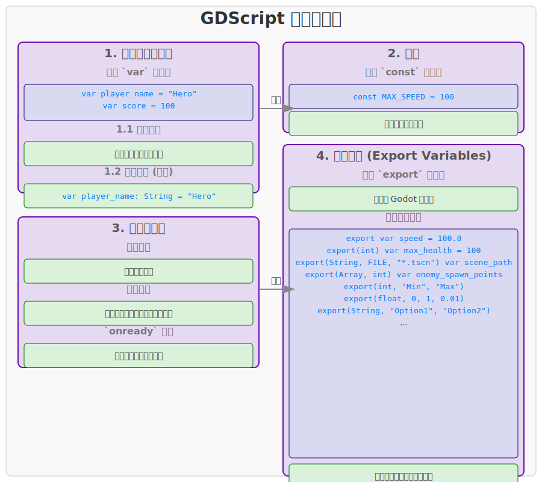

# GDScript 变量

在 GDScript 中，变量用于存储数据。GDScript 是一种动态类型语言，这意味着你通常不需要显式声明变量的类型，但也可以选择进行类型提示。

## 1. 变量声明与赋值

使用 `var` 关键字来声明一个变量，并可以使用 `=` 运算符进行赋值。

```gdscript
var player_name = "Hero"
var score = 100
var is_game_over = false
var health = 100.0
```

### 1.1 类型推断

GDScript 会根据赋给变量的值自动推断其类型。

```gdscript
var message = "Hello Godot" # 字符串类型
var count = 10             # 整型
var speed = 5.5            # 浮点型
var active = true          # 布尔型
```

### 1.2 类型提示 (可选)

虽然 GDScript 是动态类型的，但你可以使用类型提示来提高代码的可读性、帮助编辑器进行代码补全和错误检查，并在导出项目时进行类型检查。

```gdscript
var player_name: String = "Hero"
var score: int = 100
var health: float = 100.0
var is_alive: bool = true
var position: Vector2 = Vector2(0, 0)
```

类型提示并不会改变 GDScript 的动态特性，你仍然可以将不同类型的值赋给已声明类型提示的变量（尽管这通常不推荐，且编辑器会发出警告）。

```gdscript
var my_variable: int = 10
my_variable = "Hello" # 编辑器会警告，但代码仍可运行
```

## 2. 常量

使用 `const` 关键字来声明常量。常量的值在声明后不能被改变。

```gdscript
const MAX_SPEED = 100
const GRAVITY = 9.8
const PI = 3.14159
```

常量通常用于存储在程序执行期间不会改变的固定值，例如数学常数、配置值等。

## 3. 变量作用域

变量的作用域决定了变量在代码中的可见性和生命周期。

- **局部变量 (Local Variables)**：在函数内部声明的变量，只在该函数内部可见。

  ```gdscript
  func _ready():
      var local_var = "I am local"
      print(local_var)
  
  func another_function():
      # print(local_var) # 错误：local_var 在这里不可见
      pass
  ```

- **成员变量 (Member Variables)**：在脚本的顶层（类级别）声明的变量，可以在脚本的任何函数中访问。

  ```gdscript
  var member_var = "I am a member variable"
  
  func _ready():
      print(member_var)
  
  func another_function():
      print(member_var)
  ```

- **`onready` 变量**：一种特殊的成员变量，它的赋值会在节点进入场景树时（即 `_ready` 函数被调用之前）完成。这对于获取场景中的节点引用非常有用。

  ```gdscript
  onready var player_node = get_node("Player")
  
  func _ready():
      if player_node:
          print("Player node found!")
  ```

## 4. 导出变量 (Export Variables)

使用 `export` 关键字可以将变量暴露给 Godot 编辑器，这样你就可以在 Inspector 面板中直接修改这些变量的值，而无需修改脚本代码。这对于设计游戏参数、配置节点属性等非常有用。

```gdscript
export var speed = 100.0
export(int) var max_health = 100
export(String, FILE, "*.tscn,*.scn") var scene_path
export(Array, int) var enemy_spawn_points
```

`export` 关键字后面可以跟类型提示，也可以使用括号 `()` 来指定更详细的导出选项，例如：

- `export(int)`: 导出为整数类型。
- `export(float)`: 导出为浮点数类型。
- `export(bool)`: 导出为布尔类型。
- `export(String)`: 导出为字符串类型。
- `export(String, MULTILINE)`: 导出为多行字符串。
- `export(String, FILE, "*.tscn,*.scn")`: 导出为文件路径，并过滤文件类型。
- `export(String, DIR)`: 导出为目录路径。
- `export(String, GLOBAL_FILE)`: 导出为全局文件路径。
- `export(String, GLOBAL_DIR)`: 导出为全局目录路径。
- `export(Color)`: 导出为颜色。
- `export(NodePath)`: 导出为节点路径。
- `export(Resource)`: 导出为资源。
- `export(PackedScene)`: 导出为场景资源。
- `export(Array, TYPE)`: 导出为指定类型的数组。
- `export(int, "Min", "Max")`: 导出为带有范围限制的整数。
- `export(float, 0, 1, 0.01)`: 导出为带有范围和步长的浮点数。
- `export(String, "Option1", "Option2", "Option3")`: 导出为枚举（字符串选项）。

导出变量是 Godot 引擎中实现数据驱动和可视化编辑的重要特性。