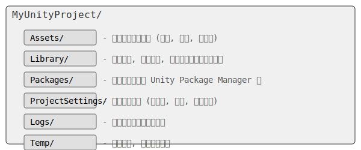

# Unity 新建工程和工程文件夹

## 一、通过 Unity Hub 新建工程

Unity Hub 是管理 Unity 项目和安装版本的官方工具。通过它，你可以方便地创建新项目、打开现有项目以及管理 Unity 编辑器的多个版本。

### 1. 打开 Unity Hub

启动 Unity Hub，你将看到项目列表界面。

### 2. 创建新项目

点击右上角的“新建项目”按钮（New Project）。

### 3. 选择项目模板

Unity 提供了多种项目模板，以适应不同类型的开发需求：

-   **2D Core**：适用于 2D 游戏开发，预配置了 2D 相关的设置和资源。
-   **3D Core**：适用于 3D 游戏开发，预配置了 3D 相关的设置和资源。
-   **URP (Universal Render Pipeline)**：通用渲染管线，提供高性能和可定制的渲染效果，适用于多种平台。
-   **HDRP (High Definition Render Pipeline)**：高清渲染管线，提供高质量的视觉效果，适用于高端平台和写实项目。
-   **VR Core**：适用于虚拟现实（VR）项目开发。
-   **AR Core**：适用于增强现实（AR）项目开发。

选择适合你项目需求的模板。对于初学者，通常选择 **3D Core** 或 **2D Core**。

### 4. 配置项目设置

-   **项目名称 (Project Name)**：输入你的项目名称，例如 `MyFirstUnityProject`。
-   **项目位置 (Location)**：选择项目文件存储的路径。建议选择一个易于管理且空间充足的目录。
-   **Unity 版本 (Unity Version)**：选择你希望使用的 Unity 编辑器版本。确保你已安装了该版本。

### 5. 创建项目

点击“创建项目”按钮，Unity 将开始创建项目并打开编辑器。这个过程可能需要一些时间，具体取决于你的电脑性能和项目模板的大小。

## 二、Unity 工程文件夹结构

一个 Unity 项目创建后，会在你指定的位置生成一个包含多个文件夹和文件的目录。理解这些文件夹的作用对于项目管理至关重要。

### 核心文件夹概览

以下是 Unity 项目中最重要的几个文件夹及其作用：



-   **Assets/**：这是你存放所有项目资源的地方，包括脚本（C#）、模型（.fbx, .obj）、纹理（.png, .jpg）、音频（.mp3, .wav）、场景文件（.unity）等。所有在 Unity 编辑器中可见和使用的文件都必须放在这个文件夹内。
-   **Library/**：这个文件夹包含了 Unity 导入资源时生成的缓存文件、元数据、导入设置等。这些文件是 Unity 内部使用的，不应该手动修改，也不应该将其纳入版本控制（如 Git）。如果删除这个文件夹，Unity 会在下次打开项目时重新生成它，但这会花费一些时间。
-   **Packages/**：这个文件夹包含了通过 Unity Package Manager (UPM) 管理的所有包。这些包可以是 Unity 官方提供的功能模块（如 TextMeshPro, Cinemachine），也可以是第三方或自定义的包。`packages-lock.json` 文件记录了包的具体版本信息。
-   **ProjectSettings/**：这个文件夹包含了项目的所有设置文件，例如输入设置、物理设置、渲染设置、标签和层级设置等。这些文件对于项目的正常运行至关重要，应该纳入版本控制。
-   **Logs/**：存放 Unity 编辑器和构建后的播放器生成的日志文件，用于调试和错误排查。
-   **Temp/**：存放 Unity 在编译和运行过程中生成的临时文件。这个文件夹的内容可以随时删除，不会影响项目。

## 三、Assets 文件夹的组织最佳实践

良好的 `Assets` 文件夹组织结构能够提高项目可读性、可维护性，并方便团队协作。

### 1. 按类型分类

最常见的组织方式是根据资源类型创建子文件夹：

```
Assets/
├── Audio/
├── Materials/
├── Models/
├── Prefabs/
├── Scenes/
├── Scripts/
├── Textures/
└── UI/
```

-   **Audio**：存放所有音频文件。
-   **Materials**：存放所有材质球。
-   **Models**：存放 3D 模型文件。
-   **Prefabs**：存放预制件（Prefab）文件。
-   **Scenes**：存放场景文件。
-   **Scripts**：存放所有 C# 脚本。
-   **Textures**：存放所有纹理图片。
-   **UI**：存放 UI 相关的资源，如 UI 预制件、UI 纹理等。

### 2. 按功能或模块分类

对于大型项目，可以考虑按功能模块进行分类，每个模块下再按类型细分：

```
Assets/
├── Characters/
│   ├── Player/
│   │   ├── Models/
│   │   ├── Materials/
│   │   └── Scripts/
│   └── Enemies/
│       ├── Models/
│       └── Scripts/
├── Environment/
│   ├── Nature/
│   └── Buildings/
├── UI/
│   ├── MainMenu/
│   └── HUD/
└── Core/
    ├── Managers/
    └── Utilities/
```

### 3. 命名规范

-   使用一致的命名规范，例如：
    -   脚本：`PlayerController.cs`, `GameManager.cs`
    -   场景：`Level1.unity`, `MainMenu.unity`
    -   材质：`M_Stone`, `M_Wood`
    -   纹理：`T_Player_Diffuse`, `T_Ground_Normal`
    -   预制件：`P_Enemy`, `P_Coin`

### 4. 避免根目录混乱

尽量避免将大量文件直接放在 `Assets` 根目录下，保持根目录的整洁。

## 四、常见问题

-   **项目打不开或报错**：尝试删除 `Library` 和 `Temp` 文件夹，然后重新打开项目，Unity 会重新生成这些文件。
-   **版本控制**：在使用 Git 等版本控制工具时，应将 `Library` 和 `Temp` 文件夹添加到 `.gitignore` 中，只提交 `Assets`、`Packages` 和 `ProjectSettings` 文件夹。
-   **资源丢失**：确保所有资源都放在 `Assets` 文件夹内，并且没有被误删或移动到 `Assets` 外部。