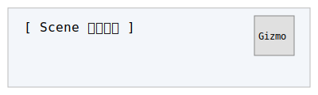
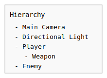

# Unity Scene 和 Hierarchy 窗口

## 一、Scene（场景）窗口

Scene 窗口用于编辑和可视化当前场景中的所有对象，是游戏开发中最常用的编辑区域。

### 主要功能
- **场景导航**：通过鼠标右键拖动、滚轮缩放、Alt+鼠标左键旋转视角等方式自由查看场景。
- **对象选择与操作**：点击选择对象，使用移动（W）、旋转（E）、缩放（R）工具对对象进行编辑。
- **Gizmo 显示**：显示坐标轴、灯光、摄像机等辅助图标。
- **2D/3D 切换**：可在 2D 和 3D 视图间切换，适应不同类型项目。

### 场景窗口简化示意（SVG 图）

## 二、Hierarchy（层级）窗口

Hierarchy 窗口以树状结构展示当前场景中的所有 GameObject（游戏对象），用于对象的组织、选择和管理。

### 主要功能
- **对象层级管理**：支持父子关系拖拽，方便构建复杂结构。
- **对象快速定位**：点击即可在 Scene 窗口中高亮对应对象。
- **右键菜单**：可新建、复制、删除、重命名对象。
- **搜索过滤**：通过顶部搜索栏快速查找对象。

### 层级窗口简化示意（SVG 图）

## 三、常用操作与技巧

- **多选对象**：按住 Shift 或 Ctrl 可多选对象。
- **拖拽父子关系**：在 Hierarchy 中拖动对象可改变其层级结构。
- **锁定 Inspector**：选中对象后可锁定 Inspector，方便对比多个对象属性。
- **场景保存**：Ctrl+S 或 Cmd+S 保存当前场景。

## 四、最佳实践

- 合理命名和分组 GameObject，便于管理。
- 使用空对象（Empty GameObject）作为父节点组织结构。
- 定期保存场景，防止数据丢失。