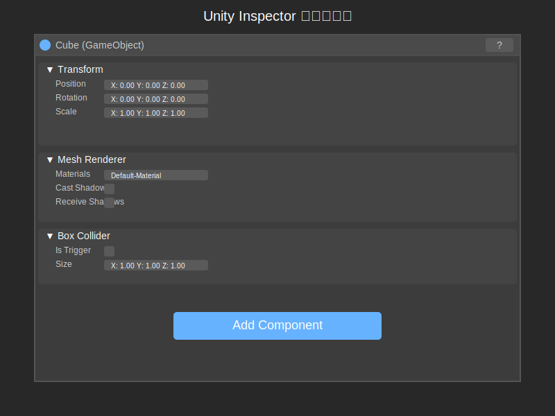
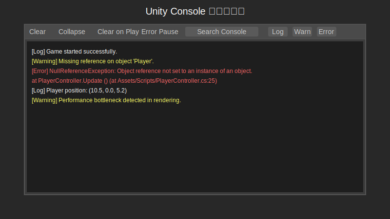

# Unity Inspector 和 Console 窗口

在 Unity 编辑器中，Inspector（检视器）窗口和 Console（控制台）窗口是进行对象属性查看和修改、以及调试输出的关键工具。它们提供了对场景中游戏对象和项目资源的详细信息访问，以及运行时日志和错误信息的显示。

## 一、Inspector 窗口

Inspector 窗口显示当前选中游戏对象、资源或设置的详细属性和组件。你可以在这里查看和修改它们的各种参数。

### 1. 主要功能

-   **属性查看与修改**：显示选中对象的各种属性（如位置、旋转、缩放）和附加的组件（如 Mesh Renderer, Collider, 脚本等），并允许你直接修改这些值。
-   **组件管理**：可以添加、移除、启用或禁用游戏对象的组件。
-   **资源预览**：当选中 Project 窗口中的资源时，Inspector 窗口会显示资源的详细信息和预览（如纹理、模型、音频剪辑等）。
-   **脚本变量显示**：如果脚本中有 `public` 或 `[SerializeField]` 修饰的变量，它们会显示在 Inspector 中，方便在编辑器中调整。

### 2. 常用操作

-   **选择对象/资源**：在 Hierarchy 窗口中选择游戏对象，或在 Project 窗口中选择资源，Inspector 窗口会自动更新显示其属性。
-   **修改属性值**：直接在 Inspector 中输入新的值或使用滑块、颜色选择器等工具修改属性。
-   **添加组件**：点击 Inspector 底部的 `Add Component` 按钮，然后搜索并选择要添加的组件。
-   **重置组件**：右键点击组件标题，选择 `Reset` 将组件属性恢复到默认值。
-   **折叠/展开组件**：点击组件标题左侧的小箭头可以折叠或展开组件的详细信息。

### 3. 可视化示意图

## 二、Console 窗口

Console 窗口用于显示 Unity 编辑器、脚本以及构建后的游戏运行时输出的日志、警告和错误信息。它是调试代码和排查问题的重要工具。

### 1. 主要功能

-   **显示日志信息**：通过 `Debug.Log()`, `Debug.LogWarning()`, `Debug.LogError()` 等函数输出的信息会显示在这里。
-   **显示警告和错误**：编译错误、运行时错误、系统警告等都会在 Console 中显示，并通常带有堆栈跟踪信息，帮助定位问题。
-   **过滤和搜索**：可以根据类型（日志、警告、错误）过滤信息，也可以通过关键词搜索特定的输出。
-   **清除输出**：可以清除 Console 窗口中的所有信息。
-   **堆栈跟踪**：点击错误或警告信息，通常会显示导致该问题的代码调用堆栈，双击可以跳转到对应的代码行。

### 2. 常用操作

-   **Clear 按钮**：清除当前 Console 窗口中的所有信息。
-   **Collapse 按钮**：将重复的日志信息折叠为一行，并显示重复次数。
-   **Clear on Play 按钮**：勾选后，每次点击播放按钮运行游戏时，Console 窗口会自动清除之前的输出。
-   **Error Pause 按钮**：勾选后，当出现错误时，游戏会自动暂停。
-   **过滤按钮**：窗口顶部有三个按钮，分别用于显示/隐藏日志、警告和错误信息。
-   **搜索框**：输入关键词搜索日志信息。

### 3. 可视化示意图

## 三、Inspector 和 Console 窗口的最佳实践

-   **Inspector 窗口**：
    -   利用 Inspector 窗口在不修改代码的情况下调整游戏对象的属性和组件参数，加快迭代速度。
    -   对于复杂的脚本，合理使用 `[Header]`, `[Tooltip]`, `[Range]` 等特性来组织和美化 Inspector 中的变量显示。
    -   理解常用组件（如 Transform, Rigidbody, Collider, Renderer）在 Inspector 中的属性设置。
-   **Console 窗口**：
    -   在开发过程中，积极使用 `Debug.Log()` 输出信息，跟踪程序执行流程和变量值。
    -   遇到错误或警告时，仔细阅读错误信息和堆栈跟踪，定位问题的根源。
    -   利用过滤和搜索功能快速找到关键信息。
    -   在发布游戏前，确保移除或禁用所有的 `Debug.Log()` 调用，避免影响性能和暴露内部信息（可以使用条件编译 `#if UNITY_EDITOR`）。