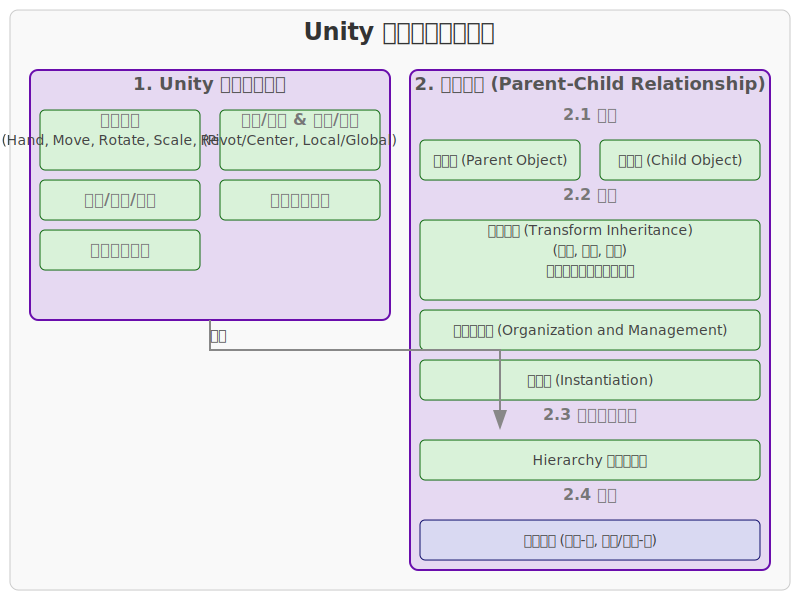

# Unity 工具栏和父子关系

## 1. Unity 编辑器工具栏

Unity 编辑器顶部的工具栏提供了对常用功能和视图的快速访问。它主要包含以下几个部分：

- **Transform Tools (变换工具)**：用于操作场景中的游戏对象，包括：
  - **Hand Tool (手型工具)**：用于在场景视图中平移。
  - **Move Tool (移动工具)**：用于移动游戏对象的位置。
  - **Rotate Tool (旋转工具)**：用于旋转游戏对象的方向。
  - **Scale Tool (缩放工具)**：用于缩放游戏对象的大小。
  - **Rect Tool (矩形工具)**：主要用于2D UI元素的移动、旋转和缩放。
  - **Custom Editor Tools (自定义编辑器工具)**：如果安装了自定义工具，会在这里显示。

- **Pivot/Center and Local/Global Toggle (轴心/中心和局部/全局切换)**：
  - **Pivot (轴心)**：基于对象的实际轴心点进行变换。
  - **Center (中心)**：基于对象的包围盒中心进行变换。
  - **Local (局部)**：基于对象自身的坐标系进行变换。
  - **Global (全局)**：基于世界坐标系进行变换。

- **Play/Pause/Step Buttons (播放/暂停/步进按钮)**：用于控制游戏在编辑器中的运行状态。

- **Layers Dropdown (层级下拉菜单)**：用于控制场景视图中哪些层级的对象可见或可选择。

- **Layout Dropdown (布局下拉菜单)**：用于切换和保存编辑器窗口布局。

## 2. 父子关系 (Parent-Child Relationship)

在 Unity 中，游戏对象之间可以建立父子关系，这是一种层级结构，对游戏对象的变换、组织和管理至关重要。

### 2.1 概念

- **父对象 (Parent Object)**：层级结构中位于上层的游戏对象。
- **子对象 (Child Object)**：层级结构中位于下层的游戏对象。

### 2.2 特性

- **变换继承 (Transform Inheritance)**：子对象的变换（位置、旋转、缩放）是相对于其父对象而言的。当父对象移动、旋转或缩放时，所有子对象也会随之进行相应的变换。
  - **位置 (Position)**：子对象的位置是其相对于父对象局部坐标系的位置。
  - **旋转 (Rotation)**：子对象的旋转是其相对于父对象旋转的增量。
  - **缩放 (Scale)**：子对象的缩放会与父对象的缩放相乘。

- **组织和管理 (Organization and Management)**：父子关系有助于在 Hierarchy 窗口中更好地组织复杂的场景。可以将相关的游戏对象组合在一起，通过操作父对象来影响一组子对象。

- **实例化 (Instantiation)**：当实例化一个带有子对象的预制件时，整个父子层级结构都会被实例化。

### 2.3 创建父子关系

在 Hierarchy 窗口中，可以通过拖拽一个游戏对象到另一个游戏对象上来创建父子关系。被拖拽的对象会成为目标对象的子对象。

### 2.4 示例

假设有一个角色模型，它由身体、头部、手臂等多个部分组成。可以将身体设为父对象，头部和手臂设为子对象。这样，当移动或旋转整个角色时，所有部分都会一起移动或旋转。如果需要单独调整手臂，可以直接操作手臂子对象。